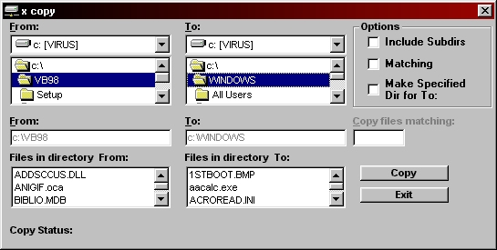



## Windows Xcopy

### Description

This will copy ALL files from one folder to another, Fast!

If Include Sub Directories is checked, all files in sub directories will be incuded (and

the subdirectories themselves of course), like XCOPY /S from used in DOS.
 
### More Info
 
you can copy your whole hard drive if not careful.

             |
---                |---
**Submitted On**   |2000-05-04 18:12:20
**By**             |[mp3guide](https://github.com/Planet-Source-Code/PSCIndex/blob/master/ByAuthor/mp3guide.md)
**Level**          |Intermediate
**User Rating**    |4.6 (23 globes from 5 users)
**Compatibility**  |VB 4\.0 \(32\-bit\), VB 5\.0, VB 6\.0
**Category**       |[Windows System Services](https://github.com/Planet-Source-Code/PSCIndex/blob/master/ByCategory/windows-system-services__1-35.md)
**World**          |[Visual Basic](https://github.com/Planet-Source-Code/PSCIndex/blob/master/ByWorld/visual-basic.md)
**Archive File**   |[CODE\_UPLOAD5509542000\.zip](https://github.com/Planet-Source-Code/mp3guide-windows-xcopy__1-7866/archive/master.zip)

